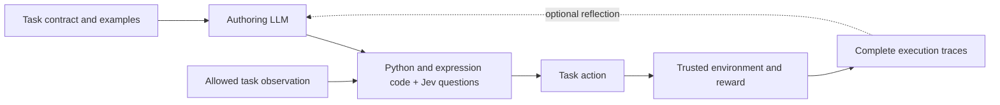

# JevHarness

**English | [简体中文](README.zh-CN.md)**

**Let an LLM write a task-specific harness for Jev. Run it, inspect its decisions, and optionally improve it using rewards and complete execution traces.**

A harness turns task observations into useful features, constructs Jev questions and criteria, and combines the structured answers into actions. The authoring LLM can change the code, questions, graph, and memory. Once the harness is fixed, execution uses that code and its Jev calls; it does not need the authoring LLM on every decision.

**Reason deeply during development. Freeze the strategy. Let Jev make fast, fuzzy decisions.**

A strong LLM brings broad intelligence and deep reasoning, but generating that reasoning for every action adds latency and cost. Jev provides fast, lightweight judgment with more limited capacity for open-ended reasoning. JevHarness combines these strengths: let the LLM write a task-specific harness, then optionally improve it using rewards and complete execution traces.

The harness preserves the LLM's reasoning strategy in explicit code, features, state, instructions, criteria, and control flow. Code computes useful facts; Jev makes **fuzzy, context-sensitive decisions** from those facts. The authoring LLM can revise the harness and its memory during development. Once the selected harness is frozen, its code and Jev calls execute without the authoring LLM on every decision.

**Pokémon result: after 5 reflection rounds, the selected harness improved Eval win rate from 25% (3/12) to 75% (9/12).** The search retained the round-3 candidate as its best harness; Eval was used for selection.

[Open the interactive demo](https://jev-harness.tianyuchen99.chatgpt.site/?autoplay=1#paired-archive) · [How it works](#how-it-works) · [Latency](#latency) · [Install and use the skill](#install-in-claude-code)

[](docs/media/pokemon-comparison.mp4)

**Initial vs. evolved:** the two harnesses play the same evaluation scenario. The initial harness loses; the selected harness wins. **Edited highlights: turn-2 decisions, then each battle’s ending.** [Watch the MP4](docs/media/pokemon-comparison.mp4) or [open the full battle archive](https://jev-harness.tianyuchen99.chatgpt.site/?autoplay=1#paired-archive).

## Install in Claude Code

Run these commands inside Claude Code:

```text
/plugin marketplace add https://github.com/TianyuCodings/JevHarness.git
/plugin install jev-harness@jevharness
/reload-plugins
```

See [skill usage, Codex installation, and manual options](#build-your-own-task).

## Start with the example

The Pokémon example includes an actual archived run, the selected harness, a browsable evolution tree, complete decision records, and replay highlights synchronized with their Jev answers. Browsing the archive makes no model requests and starts no games.

```bash
git clone https://github.com/TianyuCodings/JevHarness.git
cd JevHarness
node website/build.mjs
node website/preview.mjs --port 8768
```

Open [localhost:8768](http://localhost:8768). The viewer needs Node.js and a modern browser; battle animations download assets from the official Pokémon Showdown renderer. The archived battle log stays in the browser and is not uploaded to a replay server. See [website setup](website/README.md) for deployment and archive verification.

The reported improvement is an example result on the selection Eval set, not an independent estimate of performance on unseen games. The page shows Train/Eval only, distinguishes sampled training coverage, and includes rejected proposals.

## Latency

The selected Pokémon harness makes a full decision in **568 ms median**, with individual Jev requests taking **269 ms median**, in the archived Eval run.

| Measurement | Median | P95 | Samples |
| --- | ---: | ---: | ---: |
| Initial harness: full decision | 678 ms | 1,495 ms | 238 decisions |
| Selected harness: full decision | **568 ms** | **657 ms** | 113 decisions |
| Selected harness: individual Jev request | **269 ms** | **348 ms** | 226 requests |

These are recorded successful timings from 12 Eval games per harness, with every included Jev call explicitly marked as missing the local response cache. Full-decision time includes feature computation, parallel Jev calls, and final action selection; Jev request time includes client and network overhead. Parallel call durations overlap, so they should not be added together. Battle simulation and authoring/reflection time are outside the decision timing.

The [archived measurements and methodology](https://jev-harness.tianyuchen99.chatgpt.site/api/latency?split=eval) include cache exclusions and per-node statistics. These observations are not a controlled speed comparison; this experiment did not benchmark an LLM making every runtime decision.

## How it works



The task adapter owns observations, legal actions, side effects, and scoring. The harness owns feature construction, Jev judgments, and decision logic. That boundary makes it possible to change the harness without letting it rewrite its own reward or read hidden task state.

- **Author once, then execute.** Validate a `PipelineSpec` and run it through `PipelineRuntime`. Reflection is optional.
- **Compose judgments.** Jev supports `choice`, `score`, and `noul` answers. Multiple questions can share one request; independent graph nodes can run concurrently.
- **Improve from evidence.** The optional GEPA integration selects parents from an instance frontier, compares parent and proposal on the same training batch, and fully evaluates accepted proposals on Eval. It records actual ancestry, including rejected proposals.
- **Keep the whole trace.** Reflection includes each selected episode's complete decisions, observations, node inputs and outputs, Jev questions and answers, memory, and failures. Lossless deduplication reduces repetition; an input that exceeds the configured byte cap is archived and rejected without truncation.
- **Freeze the selected harness.** Frozen artifacts bind the specification, runtime, evaluator, and declared task resources. They still need Jev if they contain Jev nodes. A hosted model alias does not pin future provider behavior; stored responses and fresh calls have different reproducibility guarantees.

The harness writes the Jev input: a task-specific `state`, named `questions`, their answer `type`, and the `instructions` and `criteria` used to judge the available actions. Here is a **recorded turn-12 request and answer**, with the state and response metadata shortened for readability. Every displayed value is unchanged; the [complete JSON](docs/examples/pokemon-turn12-jev.json) includes the full state, answer, timing, and provenance.

```json
{
  "request": {
    "model": "typesafe-ai/jev",
    "state": {
      "position": {
        "turn": 12,
        "our_active": {
          "species": "Slowbro",
          "hp_percent": 54
        },
        "opponent_active": {
          "species": "Gastrodon",
          "hp_percent": 69
        },
        "race": {
          "our_best_move": "Psychic",
          "turns_we_need_for_the_knockout": 3,
          "turns_they_need_to_knock_us_out": 1
        }
      }
    },
    "questions": {
      "action": {
        "type": "choice",
        "instructions": "Choose the single action most likely to win the whole battle, not only this turn. Every option lists calculator estimates from public species data: type effectiveness, the share of the target remaining HP a hit removes, how many turns each side needs to knock the other out, and the damage a switch in is predicted to take. Damage numbers that mention an unrevealed move are speculation about coverage the opponent may or may not carry, so treat them as risk, not fact. Take a stated knockout when it is available, do not send a Pokemon into a hit that knocks it out on entry, keep a healthy answer for the opponent remaining team, prefer attacking when our active already wins the damage race, and remember that switching hands the opponent a free attack. Answer with exactly one of the listed action IDs.",
        "criteria": {
          "switch:2": "switch to Scizor (100 percent HP, Bug/Steel): the hit it is predicted to take is about 68 percent of its HP; it then deals about 67 percent per turn with X-Scissor, needing 2 turns while the opponent needs 2, and it outspeeds; switching concedes one free attack",
          "move:2": "Psychic (Psychic special, 90 BP, x1 neutral, accuracy 100 percent): about 41 percent of the target remaining HP, roughly 3 such hits to knock it out",
          "move:3": "Ice Beam (Ice special, 90 BP, x1 neutral, accuracy 100 percent): about 27 percent of the target remaining HP, roughly 4 such hits to knock it out",
          "move:4": "Slack Off (Normal status, 0 BP, x1 neutral, accuracy 100 percent): recovery, we sit at 54 percent HP and the predicted incoming hit is 110 percent of current HP"
        }
      }
    }
  },
  "response": {
    "answers": {
      "action": {
        "type": "choice",
        "choice": "switch:2",
        "probabilities": {
          "move:3": 0.02,
          "move:4": 0.02,
          "move:2": 0.24,
          "switch:2": 0.72
        },
        "confidence": 0.64
      }
    }
  }
}
```

Here, the harness estimates that Slowbro loses the damage race and offers a switch to Scizor among four legal actions. Jev returns `switch:2` with probability `0.72`, and the harness accepts that choice. These are **action-choice probabilities**, not the probability of winning the battle. The [selected pipeline](examples/pokemon/sample/selected-pipeline.json) shows how feature computation, parallel Jev questions, and final decision logic fit together.


## Build your own task

Install the [JevHarness skill](skills/jev-harness/SKILL.md) and describe your task to Codex or Claude Code. You do not need to handwrite Jev instructions or criteria.

**Claude Code.** [Install the plugin](#install-in-claude-code), then invoke its skill with your task:

```text
/jev-harness:jev-harness Build a harness that routes support tickets to the right team.
First clarify my inputs, legal actions, examples, success criteria, and budget.
If we have reliable rewards, add evaluation and reflection optimization.
```

`/plugin` opens Claude Code's plugin manager. The online installation downloads the skill and its references; no manual copying is needed. If this repository is private, your GitHub account needs read access and Git authentication must already work. Installing the plugin does not install Python dependencies or configure model keys.

**Codex: install the skill from GitHub.** In a Codex host that provides the built-in `skill-installer`, send:

```text
$skill-installer Install the jev-harness skill from https://github.com/TianyuCodings/JevHarness/tree/main/skills/jev-harness
```

After installation, use the skill on your next turn; restart the session if it is not discovered:

```text
$jev-harness Build a harness that routes support tickets to the right team.
First clarify my inputs, legal actions, examples, success criteria, and budget.
If we have reliable rewards, add evaluation and reflection optimization.
```

**Manual installation fallback for either host.** Clone the repository, then install the skill into the project where you want to work (replace `/path/to/your-project` with an existing directory):

```bash
git clone https://github.com/TianyuCodings/JevHarness.git
cd JevHarness
python3 scripts/install-skill.py --target both --scope project --project /path/to/your-project
```

This installs the complete skill in `.agents/skills/jev-harness/` for Codex and `.claude/skills/jev-harness/` for Claude Code. Use `--target codex` or `--target claude` if you only use one. To make the skill available across your projects instead, run:

```bash
python3 scripts/install-skill.py --target both --scope user
```

The personal locations are `~/.agents/skills/jev-harness/` and `~/.claude/skills/jev-harness/`. With this standalone installation, invoke `$jev-harness` in Codex or `/jev-harness` in Claude Code. The Claude plugin uses `/jev-harness:jev-harness` instead. Restart your agent session if the skill does not appear. The installer refuses to overwrite a different existing installation; see the [installation guide](skills/jev-harness/references/installation.md) for terminal commands, updates, and discovery details.

The skill first gathers sufficient information about the task, allowed observations and actions, available data, reward or evaluation method, runtime, credentials, and experiment resources. It then helps the agent build and validate the harness. When you request optimization and reliable feedback is available, it uses the execution trajectories and rewards for reflection, then freezes the selected harness for reuse.

## Runtime and credentials

The Python project requires Python 3.11+. Functional Python nodes currently require a supported macOS native sandbox; unavailable isolation fails closed. Version 2 expression/Jev flows do not launch those Python workers. The archived website needs neither the sandbox nor a game engine.

| Purpose | Configuration |
| --- | --- |
| Jev through Vercel AI Gateway | `JevClient(transport="vercel")`; `AI_GATEWAY_API_KEY` |
| Jev through TypeSafe directly | `JevClient(transport="typesafe")`; `TYPESAFE_API_KEY` |
| Optional authoring/reflection | `Proposer` configured for a local Claude CLI, OpenAI, Azure, or Anthropic endpoint |
| Archived website and recorded-call inspection | No model credentials |

The package and imports retain the names `auto-jev` and `auto_jev`. Provider adapters being implemented does not establish that every model or endpoint is available to your account. Keep credentials in environment variables or a local ignored `.env`; never include them in task observations or artifacts.

## Repository map

| Path | Purpose |
| --- | --- |
| [`auto_jev/`](auto_jev/) | Specification validation, parallel runtime, Jev transports, reflection, GEPA, storage, and freezing |
| [`examples/pokemon/`](examples/pokemon/) | Trusted battle adapter, seeded local engine bridge, harnesses, and interactive presentation |
| [`examples/pokemon/sample/`](examples/pokemon/sample/) | Selected harness and the curated website archive, with provenance |
| [`docs/`](docs/) | Task authoring, a recorded Jev call, comparison video, and website screenshots |
| [`.claude-plugin/`](.claude-plugin/) | Claude Code plugin manifest and GitHub marketplace catalog |
| [`skills/jev-harness/`](skills/jev-harness/) | Instructions for a coding agent authoring a task-specific harness |
| [`website/`](website/) | Read-only demonstration and its deployment adapter |

See [TypeSafe's judgment primitives](https://docs.typesafe.ai/primitives) and [GEPA's candidate selection documentation](https://gepa-ai.github.io/gepa/guides/candidate-selection/) for the underlying interfaces and optimization method.
